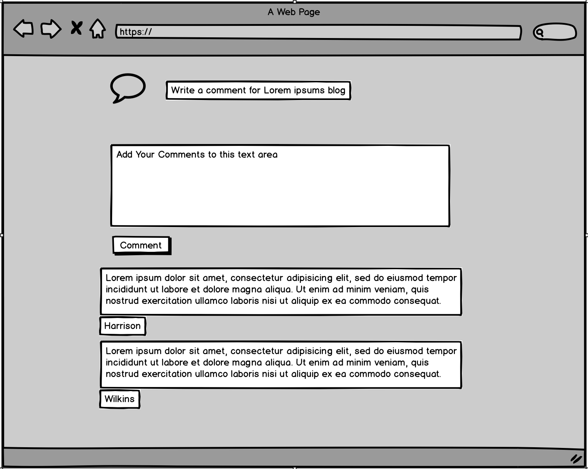

# Markdown BlogPosts

## Purpose:

Create an application where the user can write in markdown format. Give the users the ability to create, read, update and delete posts. The markdown post will be converted and displayed in HTML and then displayed to the user. The posts can either be public or private, where public posts will be displayed to anyone, and could be sorted with basic functionality. Private posts will only be displayed to the creator of the post and no other users will be able to access the post. The site will serve as a quick and easy to use interactive blog-post platform for developers or anyone who prefers to write in markdown format and convert those files into common documentation types such as pdf, .doc and .docx. It can also be used as a teaching aid to help people develop skills to be able to use the markdown format, with a simple cheatsheet implemented into the help section of the application.

## Functionality / features:

Some of the functionalities that app will have are:

Core

- Ability to create, read, update and destroy posts
- Ability to convert user markdown inputs into html output to the browser
- Ability to convert the markdown input into common documentation types such as .pdf, .doc and .docx
- Ability to restrict users ability via Javascript Web Token
- Ability to make posts public or private
- Ability to view all posts user owns
- Have a markdown cheat sheet for those who are unfamiliar on how to write it
- Ability for users to favorite a post and have easy access to the post on a later date

- Make the login pages look good
- Ability to allow certain users access to private posts, making them semi-private
- Have option to write in markdown format or write in basic text formats
- Generate an outline of the posts based on the markdown headers, (Auto-update would be nice)
- Ability to have a file system to organize posts
- Ability to drag posts for easy file system organization
- Ability to communicate with other users with chatting system
- Employ an autocorrect functionality into writing of the markdown
- Replace or Find texts functionality
- Add some keyboard shortcuts to streamline writing process (eg. Alt + Up or down to switch lines around)
- Ability to use speech recognition api to help write in markdown
- Generate QR codes for easy access to the blog post, or authentication

## Target audience:

The main audience for this application would be developers who want an easy to use online blog style application which uses markdown as the main way of text input and has the ability to convert posts/articles to a pdf format. It also introduces new developers to markdown and shows how easy it is to write in markdown and then convert using a conversion tool to convert their markdown to common documentation types.

## Tech stack:

**MongoDB** : MongoDB is a non relational database that stores data in a JSON format.

**MongoAtlas** : Part of MongoDB but a cloud hosting service that stores data.

**ExpressJS** : ExpressJS is a web app framework for Node.js we have used for this project.

**ReactJS** : A JavaScript library used for building front end UI's.

**NodeJS** : Is an open-source, cross-platform, JavaScript runtime environment that executes JS code outside of the browser.

**Mongoose** : This is an object modeling tool which works in async environments. It allows the creation of schemas to give control of the information being passed to the database. It also allows for the creation of models with CRUD methods.

**AWS** : AWS is Amazon web services this is a cloud based platform which we use to store any images from blog posts.

**bcryptjs** : We use this to hash passwords before storing them in the database.

**body-parser** : Used to parse incoming request bodies in a middleware.

**concurrently** : Allows us to run our backend and frontend concurrently and on different ports.

**is-empty** : Global function that will come in handy when we use validator.

**jsonwebtoken** : Used for authorization.

**passport** : Used to authenticate requests, which it does through an extensible set of plugins known as strategies.

**passport-jwt** : Passport strategy for authenticating with a JSON Web Token (JWT); lets you authenticate endpoints using a JWT.

**validator** : Used to validate inputs (e.g. check for valid email format, confirming passwords match).

## Data Flow Diagram

 

## Application Architecture Diagram

## User Stories:

**User Personas** 

**John**: 19 year old computer science student who is currently learning about markdown at university and want’s a easy and practical way of understanding and becoming more confident using it. He plans to use the blog to write his assignments in and the converting them to the doc type required. He would like to have a helper function which shows the basics of markdown while typing. 

**Susan**: 30 years old full stack developer. Susan would like to have a blog which supports markdown as this is what she commonly writes in when posting blogs about her experiences in the IT industry. She would like to have a user dashboard and have the ability to comment on other users posts to help provide feedback.

**Functional user stories**

As a User I want to have multiple ways of signing up to the website, as I use a preferred way of signing in.

As a User I want to be able to sign up using my email, username and a password as I don't use google Oauth or facebook login.

As a User I want to be able to save my login details for future use, to make it easier for future logins.

As a User I want to create a markdown blog post, in an user friendly and functional way.

As a User I want to make my blog posts public or private, so I can keep personal blogs or draft blogs to myself.

As a User I want to be able to edit my blog posts once they have been posted, as I may want to edit or change my posts later.

As a User I want to be able to delete my blog posts because it may no longer be relevant or I want to create a newer one.

As a User I want to be able to search for blog posts by title and find posts that most closely match what I have searched for.

As a User I want to have a search function that will autocomplete if there is a match to make it easier to find what I want.

As a User I want to be able to view other users' blog posts in an easy and friendly manner.

As a User I want to be able to comment on other users' posts so I can communicate with other users.

As a User I want to be able to see all the comments on the post to see if other users provide feedback.

As a User I want to enable/disable user comments on posts, so that I have more control over my own blog post.

As a User I want to be able to favourite other user blog posts, so that I can view my favourite posts in a different page.

As a User I want to be able to view all my favourites via a favourites button, so it is easy to access them.

As a User I want to be able to convert my markdown blog post to other document types, so that I can learn to use markdown more and then convert.

As a User once these documents are converted I want to save them locally to my computer, so that I can keep copies of my posts.

**UX/UI user stories**

As a user I want to have a simple and easy to use login/signup page which clearly shows what I need to complete or haven't yet completed, so I know exactly what needs to be done.

As a user I want a well laid out user dashboard where I am able to view my blog posts, so that the dashboard is user friendly.

As a user I want to have a thread of all blog posts as the main page, so that I can see all other users' blog posts.

As a user I want a clear and simple way to favourite people's blog posts, so that I am able to know how to use the function easily.

As a user I want to have a button to comment on users posts, so that I have a user friendly way to comment.

As a user I want to have an easy and convenient way to organize my blogs, so that I can keep all of the posts organized.

As a user I want to have an easy and convenient way to post and edit my blogs, so that I know exactly how to use the application from the get go.

## Wireframes for multiple standard screen sizes, created using industry standard software:

1. This is the login page you will be greeted with before you can access the blog posts. The right mobile view shows what the hamburger menu will show once pressed and the left will display the page as normal.
 

2. This shows the home page where you will be able to see all the blogs with a thumbnail image and title of the blog post. Both mobile and desktop views are shown, they will both be scrollable depending on the amount of posts.
 

3. This shows the creation of a blog post from the users view. They will be able to access this from the user dashboard menu.
 

4. Here you can see the view of a blog post if you have created it. The edit button is only for an individual who has created that blog post. You can also see the like and comment buttons.
 

5. This is where you can add comments to other users' blog posts, once you click on the comment icon in either browser or mobile it will take you to this comment section. 
 

6. This shows the user dashboard. The user can create, read, edit and delete posts from here. Users can also update their user details from this page.
 

7. The favourites page is the same as the home page in terms of how it looks but it will only show your favoured blog posts.
 

## Screenshots of your Trello board demonstrating use throughout the initial stages of the project:

The letter A, B, C, D, WTF is the priority in which the task should be implemented. A is important to the application while WTF is Hold my Beer.

